# 🏗️ Architecture Overview

This document provides a comprehensive view of the Kubernetes/GitOps infrastructure running on a Raspberry Pi with k3s.

## Mermaid Architecture Diagram

```mermaid
flowchart TB
    subgraph Internet["☁️ Internet"]
        GH["<b>GitHub Repository</b><br/>github.com/Undermyspell/ai<br/>━━━━━━━━━━━━━━━━━━<br/>📁 n8n/deployment/<br/>├── argocd/<br/>├── helm-charts/zumba/<br/>├── environments/<br/>│   ├── staging/<br/>│   └── production/<br/>└── scripts/"]
        
        REN["<b>🤖 Renovate Bot</b><br/><i>(Not yet configured)</i><br/>━━━━━━━━━━━━━━━<br/>Auto-updates:<br/>• Container images<br/>• Helm charts<br/>• Dependencies"]
    end

    subgraph RPI["🍓 Raspberry Pi"]
        subgraph K3S["<b>k3s Kubernetes Cluster</b>"]
            
            subgraph InfraNamespaces["⚙️ Infrastructure Layer"]
                subgraph KubeSystem["kube-system"]
                    TRAEFIK["<b>🔀 Traefik</b><br/>Ingress Controller<br/>━━━━━━━━━━━━━<br/>traefik.pi.home"]
                    SS_CTRL["<b>🔐 Sealed Secrets</b><br/>Controller<br/>━━━━━━━━━━━━━<br/>Decrypts secrets<br/>at runtime"]
                end
                
                subgraph ArgoCDNS["argocd"]
                    ARGOCD["<b>🔄 ArgoCD</b><br/>GitOps Controller<br/>━━━━━━━━━━━━━<br/>argocd.pi.home<br/>━━━━━━━━━━━━━<br/>• Auto-sync: ✅<br/>• Prune: ✅<br/>• Self-heal: ✅"]
                    
                    APPSET["<b>📦 ApplicationSet</b><br/><i>zumba-stack</i><br/>━━━━━━━━━━━━━<br/>List Generator:<br/>• staging<br/>• production"]
                end
            end

            subgraph StagingNS["📦 zumba-staging namespace"]
                subgraph StagingApps["Applications"]
                    N8N_STG["<b>🔧 n8n</b><br/>v2.6.2<br/>━━━━━━━━━━━<br/>:5678<br/>CPU: 500m-1000m<br/>Mem: 500Mi-1Gi"]
                    PG_STG["<b>🐘 PostgreSQL</b><br/>v18<br/>━━━━━━━━━━━<br/>:5432 (int)<br/>:5433 (ext)<br/>DB: n8n, evolution"]
                    EVO_STG["<b>📱 Evolution API</b><br/>v2.3.7<br/>━━━━━━━━━━━<br/>:8080<br/>WhatsApp API"]
                end
                
                subgraph StagingStorage["Storage"]
                    PVC_N8N_STG[("💾 PVC<br/>n8n-data<br/>2Gi")]
                    PVC_PG_STG[("💾 PVC<br/>postgres-data<br/>2Gi")]
                    PVC_EVO_STG[("💾 PVC<br/>evolution-data<br/>2Gi")]
                end
                
                subgraph StagingSecrets["Sealed Secrets → Secrets"]
                    SEC_STG["🔒 postgres-secrets<br/>🔒 n8n-secrets<br/>🔒 evolution-api-secrets"]
                end
            end

            subgraph ProdNS["📦 zumba-production namespace"]
                subgraph ProdApps["Applications"]
                    N8N_PROD["<b>🔧 n8n</b><br/>v2.5.0<br/>━━━━━━━━━━━<br/>:5678<br/>CPU: 500m-2000m<br/>Mem: 1Gi-2Gi"]
                    PG_PROD["<b>🐘 PostgreSQL</b><br/>v18<br/>━━━━━━━━━━━<br/>:5432 (int)<br/>:5434 (ext)<br/>DB: n8n, evolution"]
                    EVO_PROD["<b>📱 Evolution API</b><br/>v2.3.7<br/>━━━━━━━━━━━<br/>:8080<br/>WhatsApp API"]
                end
                
                subgraph ProdStorage["Storage"]
                    PVC_N8N_PROD[("💾 PVC<br/>n8n-data<br/>4Gi")]
                    PVC_PG_PROD[("💾 PVC<br/>postgres-data<br/>5Gi")]
                    PVC_EVO_PROD[("💾 PVC<br/>evolution-data<br/>2Gi")]
                end
                
                subgraph ProdSecrets["Sealed Secrets → Secrets"]
                    SEC_PROD["🔒 postgres-secrets<br/>🔒 n8n-secrets<br/>🔒 evolution-api-secrets"]
                end
            end
        end
    end

    subgraph Users["👥 Users / Local Network"]
        USER["<b>🖥️ Browser Access</b><br/>━━━━━━━━━━━━━━━━<br/>📊 zumba.pi.home<br/>📊 zumba-stage.pi.home<br/>📱 evolution.pi.home<br/>📱 evolution-stage.pi.home<br/>🔀 traefik.pi.home<br/>🔄 argocd.pi.home"]
    end

    %% GitOps Flow
    REN -.->|"PRs for<br/>updates"| GH
    GH -->|"① git pull<br/>(every 3min)"| ARGOCD
    ARGOCD -->|"② generates apps"| APPSET
    APPSET -->|"③ kubectl apply<br/>(Helm + Kustomize)"| StagingNS
    APPSET -->|"③ kubectl apply<br/>(Helm + Kustomize)"| ProdNS
    
    %% Sealed Secrets Flow
    SEC_STG -.->|"decrypted by"| SS_CTRL
    SEC_PROD -.->|"decrypted by"| SS_CTRL
    
    %% App to Storage
    N8N_STG --> PVC_N8N_STG
    PG_STG --> PVC_PG_STG
    EVO_STG --> PVC_EVO_STG
    N8N_PROD --> PVC_N8N_PROD
    PG_PROD --> PVC_PG_PROD
    EVO_PROD --> PVC_EVO_PROD
    
    %% App to DB connections
    N8N_STG -->|"DB: n8n"| PG_STG
    EVO_STG -->|"DB: evolution"| PG_STG
    N8N_PROD -->|"DB: n8n"| PG_PROD
    EVO_PROD -->|"DB: evolution"| PG_PROD
    
    %% Ingress routing
    USER -->|"HTTP/HTTPS"| TRAEFIK
    TRAEFIK -->|"IngressRoute"| N8N_STG
    TRAEFIK -->|"IngressRoute"| N8N_PROD
    TRAEFIK -->|"IngressRoute"| EVO_STG
    TRAEFIK -->|"IngressRoute"| EVO_PROD
    TRAEFIK -->|"IngressRoute"| ARGOCD

    %% Styling
    classDef github fill:#24292e,stroke:#fff,color:#fff
    classDef renovate fill:#1a8cff,stroke:#fff,color:#fff
    classDef argocd fill:#ef7b4d,stroke:#fff,color:#fff
    classDef traefik fill:#9d0fb0,stroke:#fff,color:#fff
    classDef sealed fill:#326ce5,stroke:#fff,color:#fff
    classDef app fill:#2d9c2d,stroke:#fff,color:#fff
    classDef db fill:#336791,stroke:#fff,color:#fff
    classDef storage fill:#ff9800,stroke:#fff,color:#fff
    classDef secret fill:#d32f2f,stroke:#fff,color:#fff
    classDef user fill:#607d8b,stroke:#fff,color:#fff
    
    class GH github
    class REN renovate
    class ARGOCD,APPSET argocd
    class TRAEFIK traefik
    class SS_CTRL sealed
    class N8N_STG,N8N_PROD,EVO_STG,EVO_PROD app
    class PG_STG,PG_PROD db
    class PVC_N8N_STG,PVC_PG_STG,PVC_EVO_STG,PVC_N8N_PROD,PVC_PG_PROD,PVC_EVO_PROD storage
    class SEC_STG,SEC_PROD secret
    class USER user
```



---

## 📋 Architecture Summary

| Layer | Component | Description |
|-------|-----------|-------------|
| **Source Control** | GitHub | Repository with Helm charts, Kustomize overlays, and SealedSecrets |
| **Dependency Management** | Renovate | *(Not configured yet)* - Automated image/chart updates |
| **GitOps Controller** | ArgoCD | Syncs cluster state from Git, auto-heals drift |
| **Ingress** | Traefik | Routes traffic via IngressRoutes to services |
| **Secrets Management** | Sealed Secrets | Encrypts secrets for safe git storage |
| **Kubernetes** | k3s | Lightweight K8s on Raspberry Pi |
| **Applications** | n8n, PostgreSQL, Evolution API | Workflow automation stack |
| **Environments** | Staging & Production | Isolated namespaces with different resource limits |

---

## 🔄 GitOps Flow

```
Developer → Git Push → GitHub → ArgoCD (pull) → k3s Cluster
                         ↑
                    Renovate PRs (auto-updates)
```

1. **Developer** commits changes to GitHub
2. **Renovate** creates PRs for dependency updates *(when configured)*
3. **ArgoCD** polls GitHub every 3 minutes
4. **ArgoCD** applies changes using Helm + Kustomize
5. **Sealed Secrets Controller** decrypts secrets at runtime
6. **Traefik** routes traffic to services

---

## 🌐 Service Endpoints

| Service | Staging | Production |
|---------|---------|------------|
| **n8n** | `http://zumba-stage.pi.home` | `http://zumba.pi.home` |
| **Evolution API** | `http://evolution-stage.pi.home` | `http://evolution.pi.home` |
| **PostgreSQL** | `:5433` (LoadBalancer) | `:5434` (LoadBalancer) |
| **Traefik Dashboard** | `http://traefik.pi.home` | - |
| **ArgoCD** | `https://argocd.pi.home` | - |

---

## 📊 Resource Allocation

| Resource | Staging | Production |
|----------|---------|------------|
| **n8n CPU** | 500m - 1000m | 500m - 2000m |
| **n8n Memory** | 500Mi - 1Gi | 1Gi - 2Gi |
| **n8n Storage** | 2Gi | 4Gi |
| **PostgreSQL CPU** | 250m - 500m | 500m - 1000m |
| **PostgreSQL Memory** | 512Mi - 1Gi | 1Gi - 2Gi |
| **PostgreSQL Storage** | 2Gi | 5Gi |

---

## 🔐 Secrets Management

Secrets are managed using [Bitnami Sealed Secrets](https://github.com/bitnami-labs/sealed-secrets):

```bash
# Create a new sealed secret
./scripts/create-sealed-secret.sh <environment> <secret-name> KEY1=value1 KEY2=value2

# Example
./scripts/create-sealed-secret.sh staging postgres-secrets POSTGRES_PASSWORD=mysecret
```

### Secrets per Environment
- `postgres-secrets` - Database credentials
- `n8n-secrets` - n8n encryption key
- `evolution-api-secrets` - Evolution API authentication key
